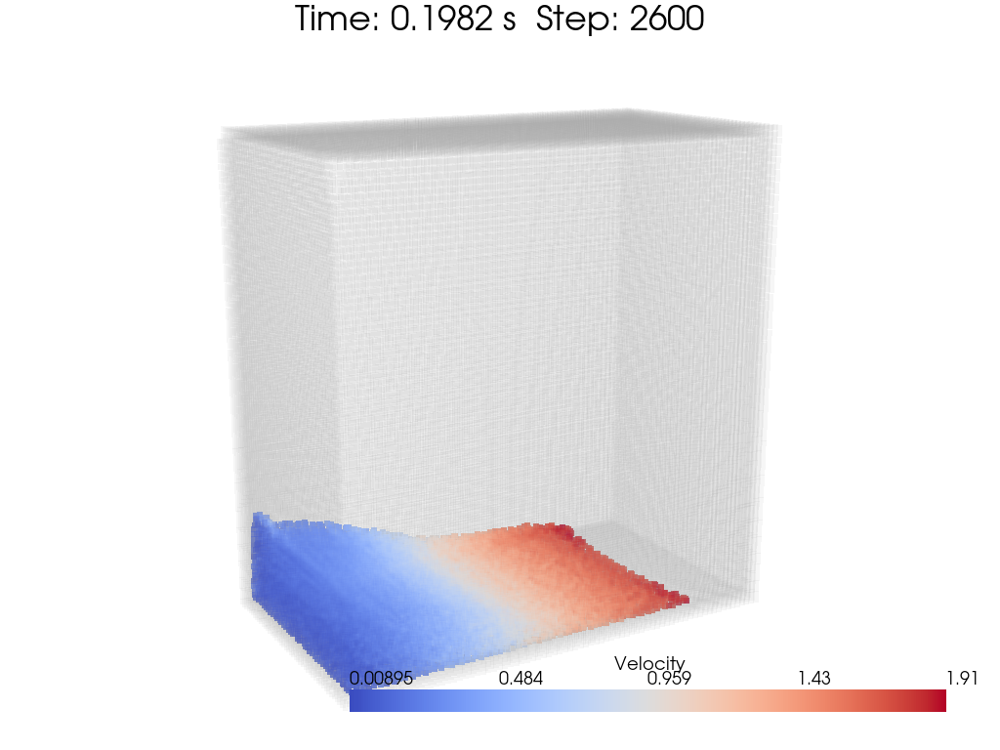

[toc]

# Cruchaga

Cruchaga problem is originally from the paper [Cruchaga 2006](https://link.springer.com/article/10.1007/s00466-006-0043-z). The author used VOF & FEM to solve the problem numerically and validated the results with experiments.

 
fig. Cruchaga experiment captured by camera

Here, I will present the result both in 2D and 3D. The problem setup is shown in the following figure from paper.

 
fig. Cruchaga problem setup

# 2D result

The evaluation of the 2D case is shown in the following figures.

 

 

 

 

 
fig. Cruchaga 2D result colormap

Dimensionless horizontal position at different time's comparison with 3D experiement is shown in the following figure:

 
fig. Cruchaga 2D result comparison with 3D experiment

Maybe a better wall drag model is needed to improve the result.

# 3D result

The evaluation of the 2D case is shown in the following figures.

 

 

 

 

 
fig. Cruchaga 3D result colormap

Dimensionless horizontal position at different time's comparison with 3D experiement is shown in the following figure:

 
fig. Cruchaga 3D result comparison with 3D experiment

Still, maybe a better wall drag model is needed to improve the result.

# Notes

1. Remember, `libCompulsiveForce!` here has some parameters you can modified. Such as `h` devided by $0.01c^2$. You may make it larger for numerical stability.
2. In 3D case, you'd better make the calculation domain be devided strictly by kernel smoothing length $h$. Otherwise, a large number of useless neighbour search will be performed causing waste of time.
3. The wall drag model is not good enough. We may keep working on improving it.