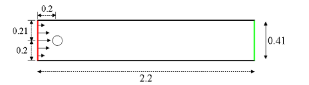
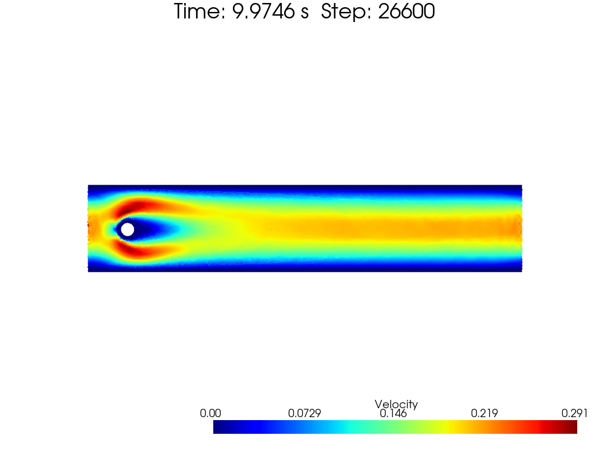
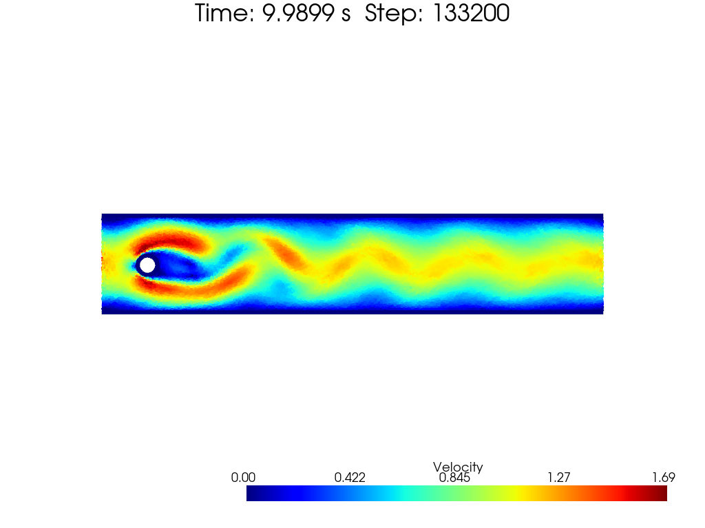
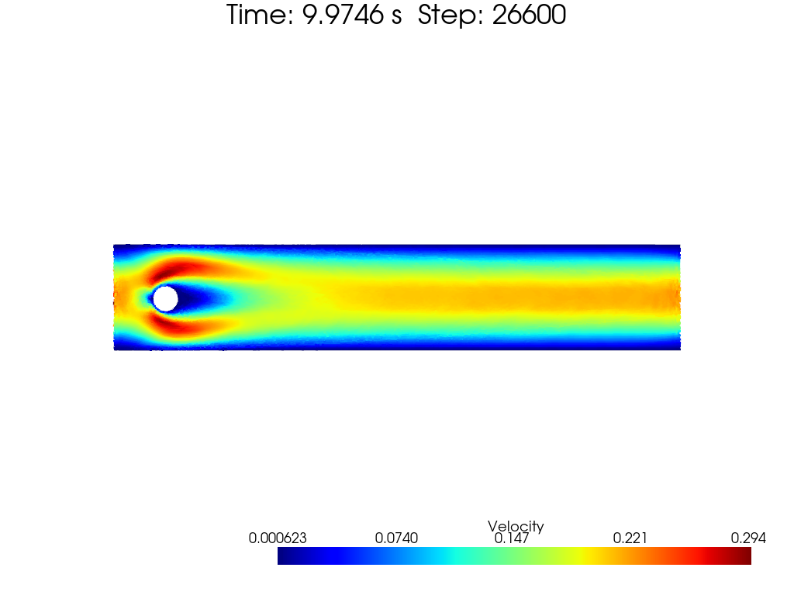
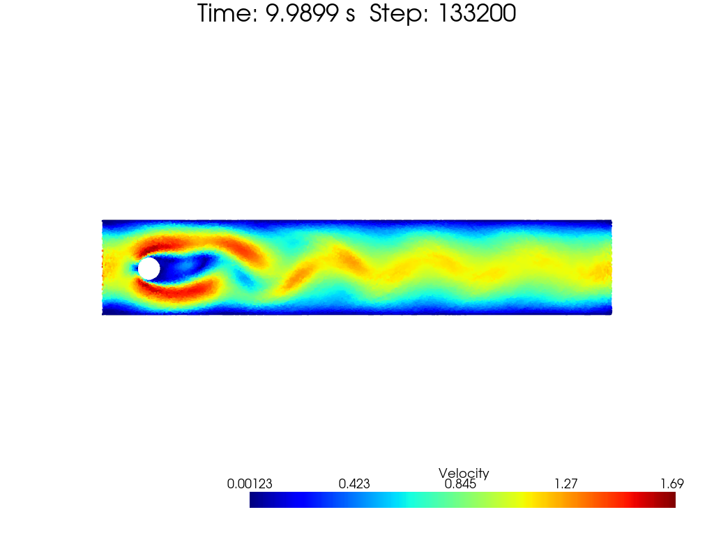
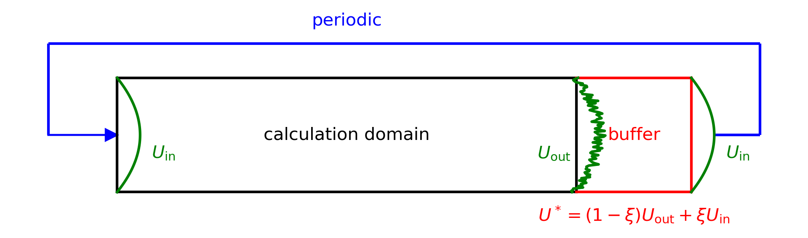
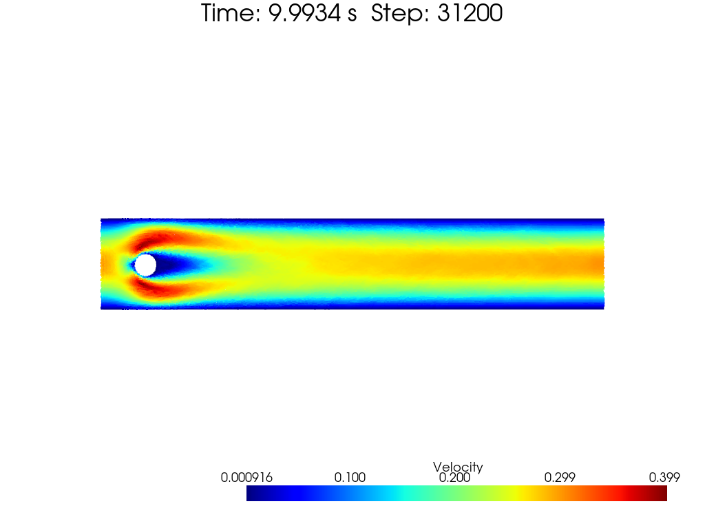
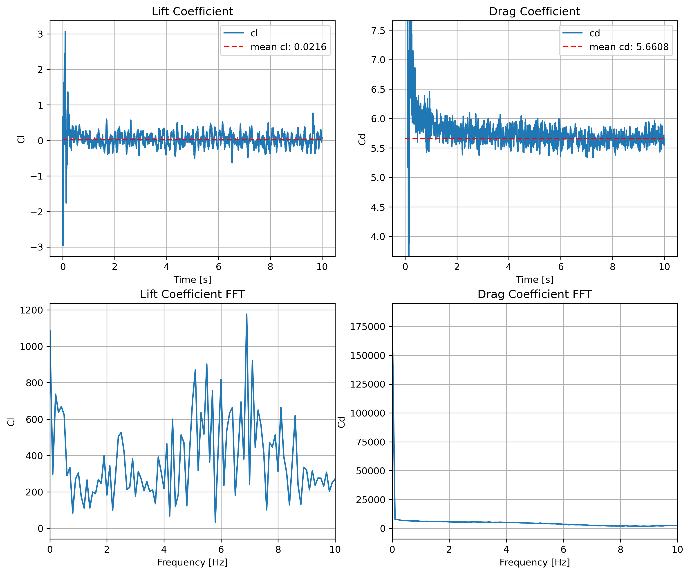
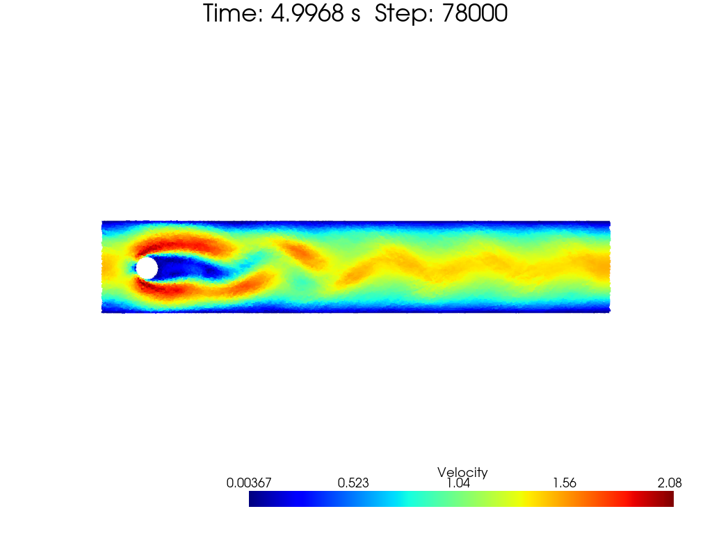
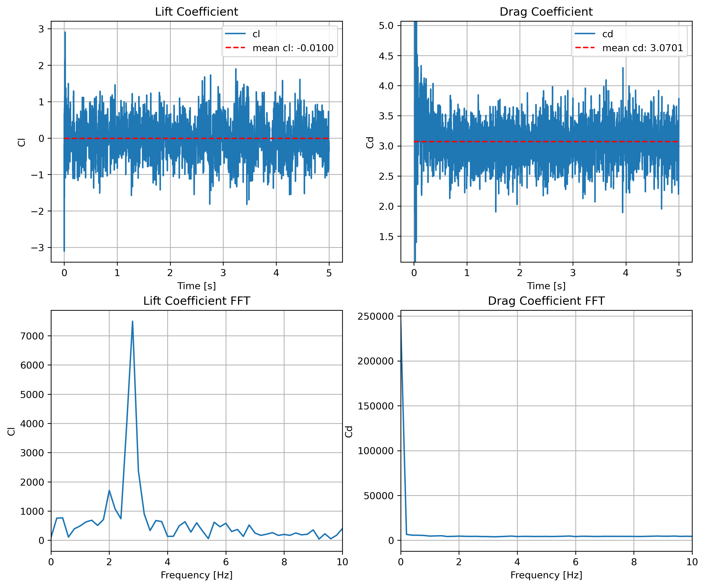

[toc]

# Cylinder

Flow over a cylinder is a classic problem in fluid dynamics. See [benchmark](https://wwwold.mathematik.tu-dortmund.de/~featflow/en/benchmarks/cfdbenchmarking/flow/dfg_benchmark1_re20.html) for more details.

This example is also included by [SmoothedParticles.jl](https://github.com/OndrejKincl/SmoothedParticles.jl/blob/master/examples/cylinder.jl). Although, he applied an artificial central force to keep particles close to cylinder surface -- personally, I beg to differ.

For simplicity, we adopt periodic boundary conditions in the x-direction.

 
fig. Flow over a cylinder

# Different Reynolds numbers (treat wall particles as the same)

Reynolds number is defined as:

$$
\begin{equation}
    Re=\frac{\rho u L}{\mu}
\end{equation}
$$

where $\rho$ is the fluid density, $u$ is the characteristic velocity, $L$ is the characteristic length (usually set as the diameter of the cylinder), and $\mu$ is the dynamic viscosity.

## Re = 20

The flow is laminar at $Re=20$. Let's see the flow pattern around the cylinder.

 
fig. Flow pattern around a cylinder at Re=20

## Re = 100

The flow pattern meets unsymmetric vortex shedding at $Re=100$.

 
fig. Flow pattern around a cylinder at Re=100

# Different Reynolds numbers (pressure extrapolation)

## Re = 20

The flow is laminar at $Re=20$. Let's see the flow pattern around the cylinder.

 
fig. Flow pattern around a cylinder at Re=20

## Re = 100

The flow pattern meets unsymmetric vortex shedding at $Re=100$.

 
fig. Flow pattern around a cylinder at Re=100

# Different Reynolds numbers (pressure extrapolation & buffer + periodic boundary)

## Buffer + Periodic boundary condition

 
fig. Buffer + Periodic boundary condition (a simple draft)

The buffer length performs a linear interpolation between the buffer region and the periodic boundary. The smooth zone is set to ensure the correct inlet flow condition.

## Re = 20

The flow is laminar at $Re=20$. Let's see the flow pattern around the cylinder.

 
fig. Flow pattern around a cylinder at Re=20

And the lift and drag coefficients curves within time are shown below.

 
fig. Lift and drag coefficients curves within time at Re=20

The given referenced drag coefficient $C_D$ is around $5.5795$, which is quite similar to my results.

## Re = 100

The flow pattern meets unsymmetric vortex shedding at $Re=100$.

 
fig. Flow pattern around a cylinder at Re=100

And the lift and drag coefficients curves within time are shown below.

 
fig. Lift and drag coefficients curves within time at Re=100

The reference $c_l,c_d$ and $St$ from [web page](https://wwwold.mathematik.tu-dortmund.de/~featflow/en/benchmarks/cfdbenchmarking/flow/dfg_benchmark2_re100.html) fits my results quite well.

# Notes

1. [SmoothedParticles.jl](https://github.com/OndrejKincl/SmoothedParticles.jl/blob/master/examples/cylinder.jl) applied an artificial central force to keep particles close to the cylinder surface. I don't think it tells the real story. The flow should be driven by the fluid dynamics itself. Central force is just the phenomenon of the fluid dynamics, not the cause.
2. Such benchmark is also included by [SphinXsys](https://www.sphinxsys.org/html/examples/example12_2D_flowaroundcylinder.html). However, no curves comparison or $C_L, C_D$ seems to be provided.
3. In my personal trial, $C_L, C_D$'s value seemes to only depend on the Reynolds number or inflow speed, as well as Strouhal number. The Strouhal number is defined as $fL/U_{\text{mean}}$.
4. Current results doesn't fit the benchmark results well. In $Re=100$'s case, both my $C_D$ and $St$ seems to be $\frac{2}{3}\sim\frac{5}{6}$ of the benchmark results. For such problem still lacks of reference, maybe I will try to improve it in the future. (Imporved inflow speed may cause better fitted results).
5. **important:** it seems that a simple periodic boundary won't accurately perform the inlet flow condition. A better boundary handling method should be applied.