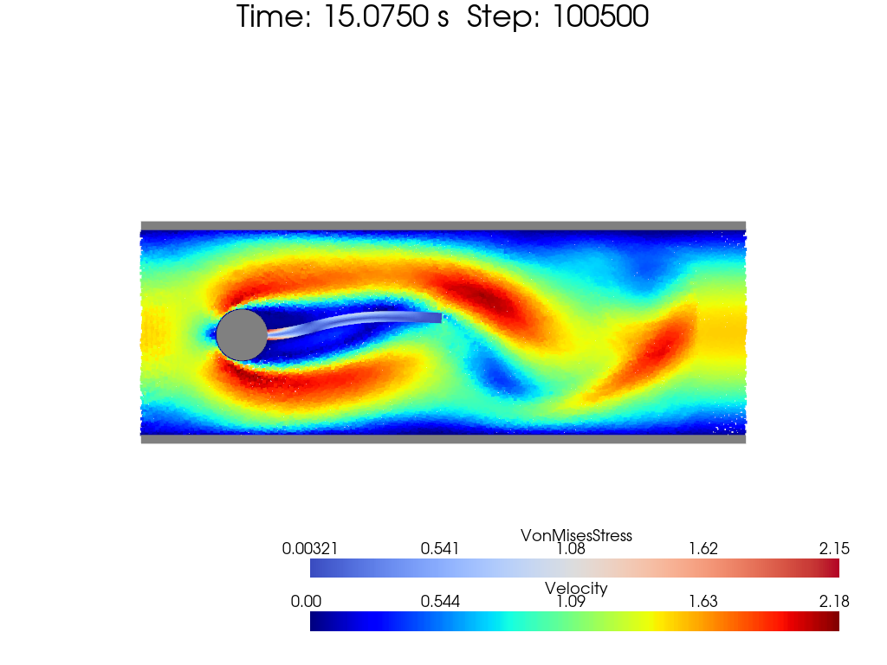
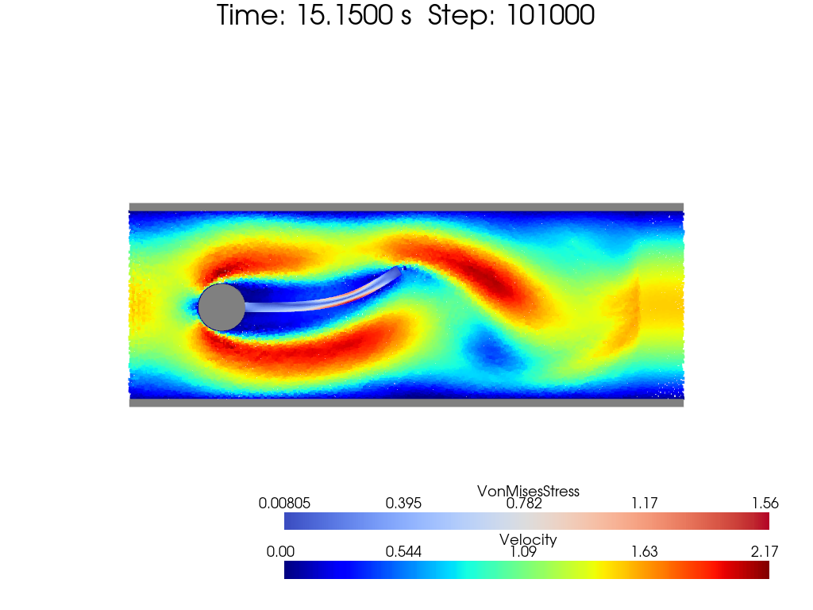
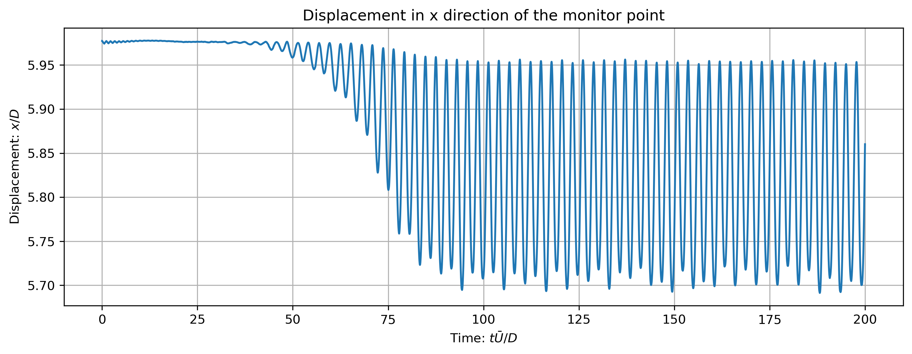

[toc]

# FSI: Cylinder with Plate

Flow over a cylinder with a plate is a classic problem in fluid-structure interaction. A large number of studies have been conducted to investigate the flow pattern and the interaction between the fluid and the structure. 

Original benchmark reference can be found by [Proposal for Numerical Benchmarking of Fluid-Structure Interaction between an Elastic Object and Laminar Incompressible Flow - Turek Stefan](http://link.springer.com/10.1007/3-540-34596-5_15).

 
fig. FSI: Cylinder with Plate Problem Setup

As is shown in the figure above, the fluid domain is a square box with a cylinder and a plate inside. The cylinder is fixed and the plate is free to move. The fluid is incompressible and the flow is laminar. The Reynolds number varies in $20, 100, 200$, marked as fsi1, fsi2 and fsi3.

Other references can be found:

- [SPH modeling of fluid-structure interaction - Han and Hu](http://link.springer.com/10.1007/s42241-018-0006-9)
- [A multi-resolution SPH method for fluid-structure interactions - Zhang Chi](https://linkinghub.elsevier.com/retrieve/pii/S0021999120308020)
- [An integrative SPH method for heat transfer problems involving fluid-structure interaction- Tang and Zhang](https://link.springer.com/10.1007/s10409-022-22248-x)

[SPHinXsys](https://www.sphinxsys.org/index_zh.html) provides [documents and demo](https://www.sphinxsys.org/html/theory.html#multi-resolution-fsi-coupling) of such problem. Also, they post the colormap as logo on their websites.

## FSI1

The Reynolds number is 20. Such case is almost a steady flow.

 

 

 
fig. FSI1: Cylinder with Plate Case 1 Colormap

## FSI2

The Reynolds number is 100. The flow is unsteady.

 

 

 
fig. FSI2: Cylinder with Plate Case 2 Colormap

To validate the simulation results, a monitor point located at the end of the plate's position is recorded. The displacement of the plate is shown in the figure below.

 
fig. FSI2: Cylinder with Plate Case 2 Displacement in X Direction

 
fig. FSI2: Cylinder with Plate Case 2 Displacement in Y Direction

 
fig. FSI2: Cylinder with Plate Case 2 Frequency Spectrum

 
fig. FSI2: Cylinder with Plate Case 2 Displacement Trajectory

Here's a comparison table of my code and the reference.

| Reference | Amplitude in $y$ direction (/$D$) | Frequency $f_0$ |
| --- | --- | --- |
| Turek and Hron | 0.830 | 0.190 |
| Bhardwaj and Mittal | 0.920 | 0.190 |
| Tian et al. | 0.784 | 0.190 |
| Han and Hu | 0.886 | 0.168 |
| My Code | 0.819 | 0.180 |

## FSI3

The Reynolds number is 200. The flow is unsteady.

 

 

 
fig. FSI3: Cylinder with Plate Case 3 Colormap

