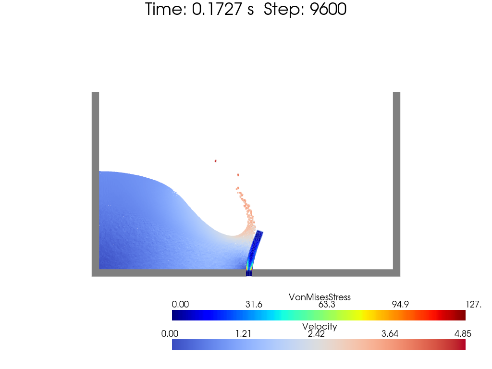
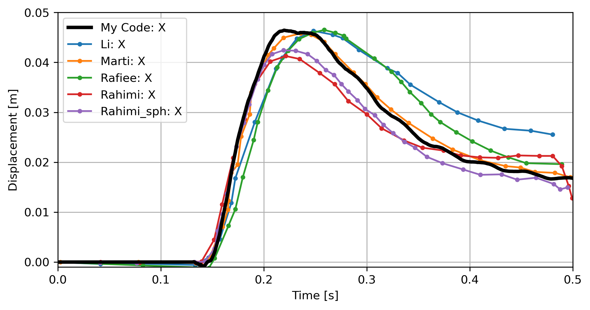

[toc]

# FSI: Dam Break onto Obstacle

The dam break onto an obstacle is a classic problem in fluid-structure interaction. A large number of studies have been conducted to investigate the flow pattern and the interaction between the fluid and the structure.

Reference can be found from [An SPH-based FSI framework for phase-field modeling of brittle fracture under extreme hydrodynamic events - Rahimi and Mohammad Naqib](https://link.springer.com/10.1007/s00366-023-01857-0). Also, [TrixiParticles.jl](https://github.com/trixi-framework/TrixiParticles.jl/blob/main/examples/fsi/dam_break_plate_2d.jl) includes the simulation of such problem.

 
fig. FSI: Dam Break onto Obstacle Problem Setup

## Results and Discussion

The contour plot of the fluid domain is shown below.

Fluid particles are colored by the velocity magnitude. The obstacle is colored by Von Mises stress. The colormap is shown below.

 

 

 

 
fig. FSI: Dam Break onto Obstacle Original Colormap

The monitor point located on left-upper corner of the obstacle is recorded. A comparison of the displacement between my code and the reference is shown below.

 
fig. FSI: Dam Break onto Obstacle Displacement Comparison

