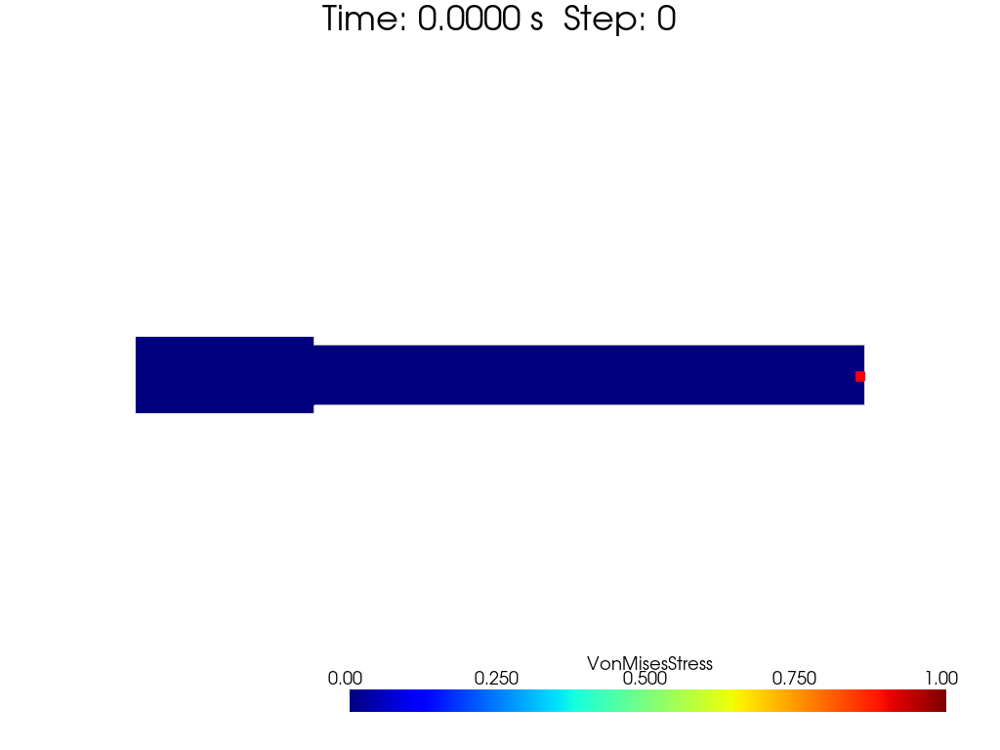
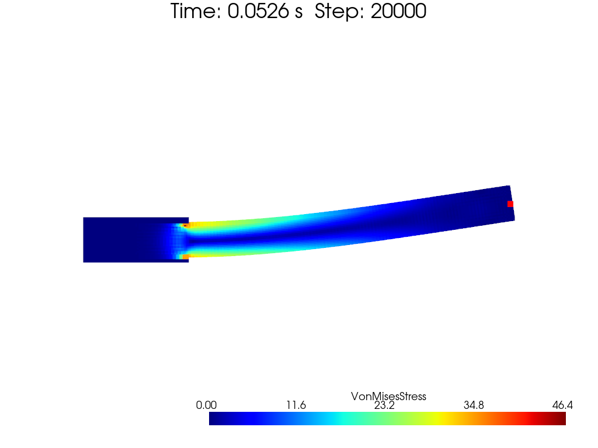
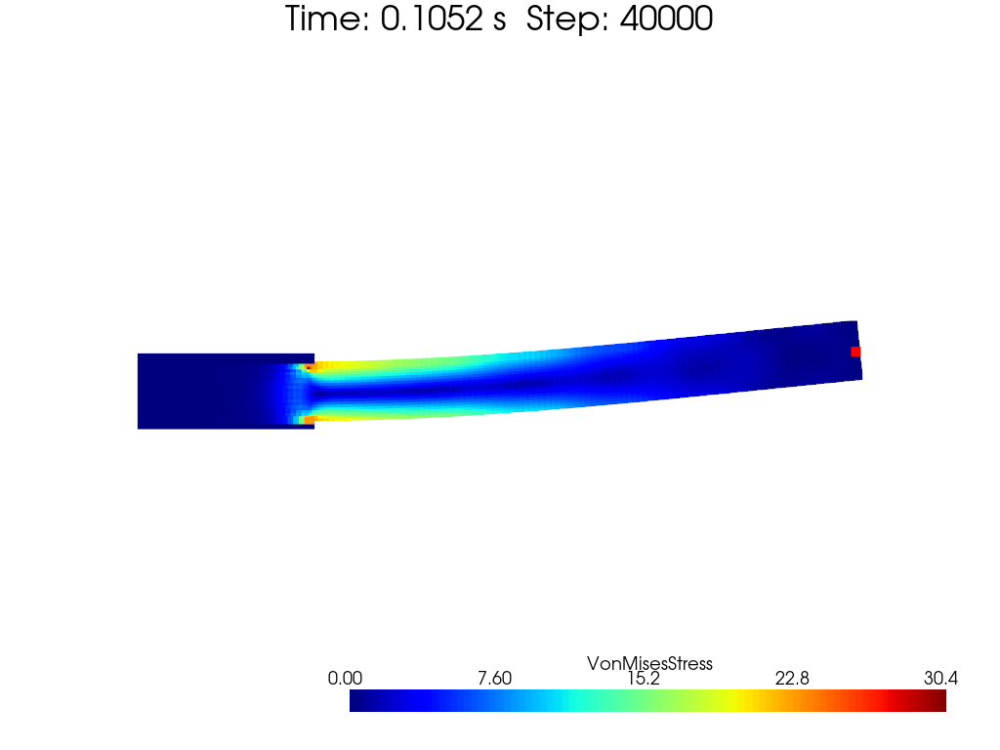
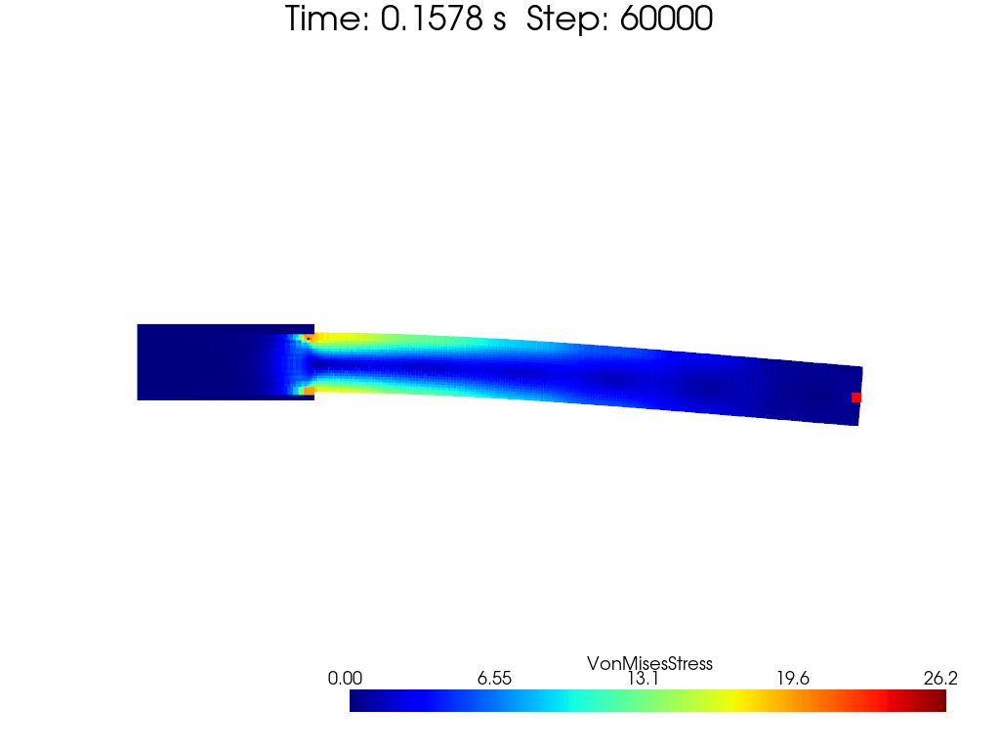
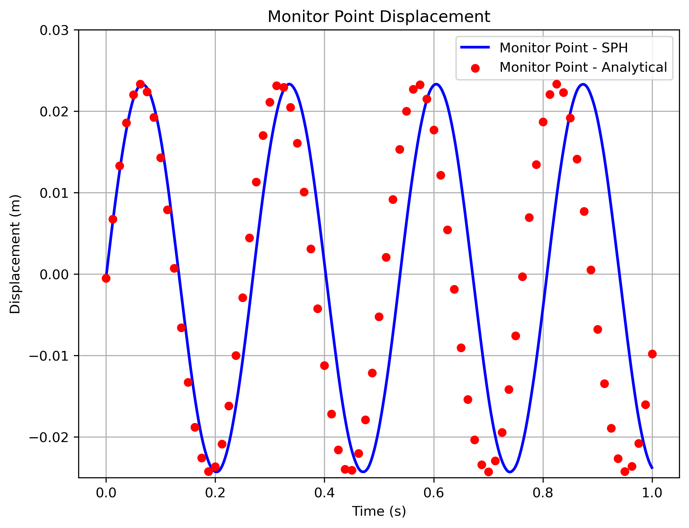

[toc]

# Hanging Beam

This example is originally from [Essentially non-hourglass and non-tensile-instability SPH elastic dynamics, Zhang, Chi 2024](https://www.sciencedirect.com/science/article/pii/S0021999124003218).

The problem discussed in this example is a hanging beam. The beam is made of a linear elastic material with Young's modulus $E$, poisson's ratio $\nu$ and density $\rho$. The beam is hanging from a fixed point and is applied with an initial velocity. The model setup picture is shown below.

<center>

</br>
figure: Model setup for hanging beam example (2D)
</center>

We first discuss the 2D case.

# 2D Case

Let's see the 2D case first. 

The color map of the beam is shown below.

<center>


</br>


</br>
figure: Color map of hanging beam example, velocity, jet (2D)
</center>

And the comparison of the beam shape at different time steps is shown below.

<center>

</br>
figure: Comparison of beam shape at different time steps (2D)
</center>

Contrary to [SPH elastic dynamics](https://linkinghub.elsevier.com/retrieve/pii/S0045782501002547), ths `Sphinxsys` team's paper [Essentially non-hourglass and non-tensile-instability SPH elastic dynamics](http://arxiv.org/abs/2310.08444) provides a different analytical solution.

$$
\begin{equation}
    \omega^2 = \frac{EH^2k^4}{12\rho_0 (1-\nu^2)}\quad
    \omega^2 = \frac{EH^2k^4}{12\rho_0 (1-\nu^4)}
\end{equation}
$$

Currently I have no idea on who's correct.

# Discussion

Actually, the author of the paper provides a confusing formula for the $\frac{\mathrm{d}\vec{v}_s}{\mathrm{d}t}$, as well as a magic number $\zeta$ related to smooth kernel and particle spacing. You may modify it to make your curve fits for the analytical solution.

$$
\begin{equation}
\frac{\mathrm{d}\vec{v}_s}{\mathrm{d}t} = 
2\zeta \frac{G}{\rho}\int_0^t\left(
    \sum_j \frac{m_j}{\rho_j}
    \frac{\vec{e}_{ij}\cdot\vec{v}_{ij}}{r_{ij}}
    \nabla W_{ij}
\right)\mathrm{d}t
\end{equation}
$$

In his paper, the author says that *$\zeta$ is a parameter related to the smoothing length $h$ and the type of kernel function. $\zeta$ needs to be calibrated with numerical experiments.* He choose Wendland 5-th kernel, $h=2.6\Delta p$, and he sets that:

$$
\begin{equation}
\zeta = 0.7d + 2.1
\end{equation}
$$

where $d$ is the dimension of the problem.

# More Accurate Continuum Mechanics Formulation

When I come to write FSI (fluid-solid, or say structure, interaction) code, a more accurate continuum mechanics formulation is needed. I will discuss this and provide an example code.

See references:

- [An accurate FSI-SPH modeling of challenging fluid-structure interaction problems in two and three dimensions](https://www.sciencedirect.com/science/article/abs/pii/S0029801820314608)
- [An SPH-based FSI framework for phase-field modeling of brittle fracture under extreme hydrodynamic events](https://link.springer.com/article/10.1007/s00366-023-01857-0)
- [An integrative SPH method for heat transfer problems involving fluid-structure interaction](https://link.springer.com/10.1007/s10409-022-22248-x)
- [SPH modeling of fluid-structure interaction](http://link.springer.com/10.1007/s42241-018-0006-9)
- [Sphinxsys-Tutorial: Schemes for solid dynamics](https://www.sphinxsys.org/html/theory.html#schemes-for-solid-dynamics)
- [知乎-连续介质力学简介](https://zhuanlan.zhihu.com/p/595941534)

And the source code can be found in [here](../../src/SPH/Cart/LargeDeformationContinuumMechanics.jl).

## Formulation in Continuum Mechanics

We suppose a reference configuration $\mathcal{B}_0$ and a current configuration $\mathcal{B}_t$. A particle located at $\vec{X}$ in $\mathcal{B}_0$ is now located at $\vec{x}$ in $\mathcal{B}_t$. The deformation gradient tensor $\mathbf{F}$ is defined as:

$$
\begin{equation}
    \mathbf{F} = \nabla^0 \vec{x} = \frac{\partial \vec{x}}{\partial \vec{X}}
\end{equation}
$$

where $\nabla^0$ refers to the gradient operator in the reference configuration. Denote the difference between the current and reference positions of a particle as $\vec{u} = \vec{x} - \vec{X}$. The deformation gradient tensor can be expressed as:

$$
\begin{equation}
    \mathbf{F} = \frac{\partial (\vec{X} + \vec{u})}{\partial \vec{X}} = \mathbf{I} + \frac{\partial \vec{u}}{\partial \vec{X}}
\end{equation}
$$

It's obvious that, as the deformation evolves, the deformation gradient tensor $\mathbf{F}$ can be expressed as the velocity's integral over time:

$$
\begin{equation}
    \mathbf{F} = \mathbf{I} + \int_0^t \frac{\partial \vec{v}}{\partial X} \mathrm{d}t
\end{equation}
$$

where $\vec{v}$ is the velocity field. At the same time, the density evolution satisfies:

$$
\begin{equation}
    \rho J=\rho_0 \to \rho \det(\mathbf{F}) = \rho_0
\end{equation}
$$

Material strain tensor, or say Green-Lagrange strain tensor, is defined as:

$$
\begin{equation}
    \mathbf{E} = \frac{1}{2}(\mathbf{F}^T\mathbf{F} - \mathbf{I})
\end{equation}
$$

which is symmetric. 2nd Piola-Kirchhoff stress tensor $\mathbf{S}$ should be defined as the derivative of the strain energy density $W$ with respect to the Green-Lagrange strain tensor $\mathbf{E}$:

$$
\begin{equation}
    \mathbf{S} = \frac{\partial W}{\partial \mathbf{E}}
    \to{\text{linear elastic}}\to
    \mathbf{S} = \mathrm{C}:\mathrm{E}
\end{equation}
$$

where $\mathrm{C}$ is the fourth-order elasticity tensor. For a normal elastic material with Young's modulus $E$ and Poisson's ratio $\nu$, we define three coefficients:

$$
\begin{equation}
    \begin{aligned}
        K &= \frac{E}{3(1-2\nu)} \quad \text{(bulk modulus)} \\
        \mu &= G = \frac{E}{2(1+\nu)} \quad \text{(shear modulus)}\\
        \lambda &= K-\frac{2}{3}\mu = \frac{E\nu}{(1+\nu)(1-2\nu)} \quad \text{(Lam\'e's first parameter)}
    \end{aligned}
\end{equation}
$$

Thus 2nd Piola-Kirchhoff stress tensor $\mathbf{S}$ can be expressed as:

$$
\begin{equation}
    \begin{aligned}
        \mathbf{S} &= \lambda\mathrm{tr}(\mathbf{E})\mathbf{I} + 2\mu\mathbf{E}\\
        S_{ij} &= \lambda E_{kk}\delta_{ij} + 2\mu E_{ij}
        \quad \text{(Einstein summation)}
    \end{aligned}
\end{equation}
$$

1st Piola-Kirchhoff stress tensor $\mathbf{P}$ is defined after $\mathbf{S}$ and $\mathbf{F}$:

$$
\begin{equation}
    \mathbf{P} = \mathbf{F}\mathbf{S} =
    \mathbf{F}[\lambda\mathrm{tr}(\mathbf{E})\mathbf{I} + 2\mu\mathbf{E}]
\end{equation}
$$

Momentum in configuration $\mathcal{B}_t$ is shown as below:

$$
\begin{equation}
    \frac{\mathrm{d}^2\vec{x}}{\mathrm{d}t^2} = 
    \frac{1}{\rho_0}\nabla^0 \mathrm{P} + \vec{g}
\end{equation}
$$

## SPH discretization in Continuum Mechanics

**Keep in mind that, neighbours around one particle is fixed at its initial state.**

Firstly, we introduce a correction matrix introduced by Vignjevic:

$$
\begin{equation}
    \mathrm{B}^0_i = 
    \left[
        \sum_j V_j^0(\vec{X}_j - \vec{X}_i)
        \otimes
        \nabla^0 W_{ij}
    \right]^{-1}
    =
    \left[
        -\sum_j \frac{V_j}{r_{ij}^0}^0
        \frac{\partial W^0_{ij}}{\partial r^0_{ij}}
        \vec{X}_{ij}
        \otimes
        \vec{X}_{ij}
    \right]^{-1}
\end{equation}
$$

Correction matrix $\mathrm{B}^0_i$ should  approximate unit tensor $\mathbf{I}$ in the reference configuration. If $\mathrm{B}^0_i$ is non-invertible, we can directly set it to $\mathbf{I}$. Currently we need to store:

- `corrected_mat_` for storing $\mathrm{B}^0_i$
- `kernel_gradient_0_vec_list_` for storing a series of $\nabla^0 W_{ij}$

Then, we can calculate the deformation gradient tensor $\mathbf{F}$:

$$
\begin{equation}
    \mathbf{F}_i = \mathrm{I}+
    \sum_j V_j^0 (\vec{u}_j - \vec{u}_i) \otimes \nabla^0 W_{ij}\mathrm{B}^0_i
\end{equation}
$$

For $\otimes$ operator satisfies law of combination, $\nabla^0 W_{ij}\mathrm{B}^0_i$ can be calculated and stored as `corrected_kernel_gradient_0_vec_list_` in the beginning for efficiency. A simple proof can be shown as below:

$$
\begin{equation}
    \begin{aligned}
        a_ib_j\vec{e}_i\vec{e}_j\cdot T_{pq}\vec{e}_p\vec{e}_q&=
        a_ib_jT_{pq}\vec{e}_i\delta_{pj}\vec{e}_q\\
        &= a_ib_j T_{jk}\vec{e}_i\vec{e}_k\\
        a_i\vec{e}_i (b_j\vec{e}_j\cdot T_{pq}\vec{e}_p\vec{e}_q)&=
        a_i b_jT_{jq}\vec{e}_i\vec{e}_q\\
        &= a_i b_j T_{jk}\vec{e}_i\vec{e}_k
    \end{aligned}
\end{equation}
$$

In my personal test, equation above suffers from numerical instability. However, it can be modified as:

$$
\begin{equation}
    \mathbf{F}_i = \mathrm{I}-
    \int_0^t
    \sum_j V_j^0 \vec{v}_{ij} \otimes \nabla^0 W_{ij}\mathrm{B}^0_i
    \mathrm{d}t
\end{equation}
$$

Currently we need to store:

- `corrected_mat_` for storing $\mathrm{B}^0_i$
- `kernel_gradient_0_vec_list_` for storing a series of $\nabla^0 W_{ij}$
- `corrected_kernel_gradient_0_vec_list_` for storing a series $\nabla^0 W_{ij}\mathrm{B}^0_i$
- `deformation_gradient_mat_` for storing $\mathbf{F}_i$

Green-Lagrange strain tensor $\mathbf{E}$ can be calculated as:

$$
\begin{equation}
    \mathbf{E}_i = \frac{1}{2}(\mathbf{F}_i^T\mathbf{F}_i - \mathrm{I})
\end{equation}
$$

which is also symmetric. Then, we can calculate the 2nd Piola-Kirchhoff stress tensor $\mathbf{S}_i$:

$$
\begin{equation}
    \mathbf{S}_i = \lambda\mathrm{tr}(\mathbf{E}_i)\mathrm{I} + 2\mu\mathbf{E}_i
\end{equation}
$$

which is symmetric. 1st Piola-Kirchhoff stress tensor $\mathbf{P}_i$ can be calculated as:

$$
\begin{equation}
    \mathbf{P}_i = \mathbf{F}_i\mathbf{S}_i
\end{equation}
$$

which is symmertric. However, such stress need to be corrected by corrected matrix $\mathrm{B}^0_i$:

$$
\begin{equation}
    \mathbf{P}_i^c = \mathbf{P}_i \mathrm{B}^0_i
\end{equation}
$$

Finally, we could calculate the acceleration of particle $i$ as:

$$
\begin{equation}
    \frac{\mathrm{d}\vec{v}_i}{\mathrm{d}t} = 
    \frac{2}{m_i}\sum_j V_i^0 V_j^0
    \frac{1}{2}
    \left(
        \mathrm{P}_i^c + \mathrm{P}_j^c
    \right)\nabla^0 W_{ij}
\end{equation}
$$

$\mathrm{E}_i, \mathrm{P}_i, \mathrm{P}_i^c$ is worthy to be stored as follows:

- `green_lagrange_strain_mat_` for storing $\mathbf{E}_i$
- `piola_kirchhoff_1st_stress_mat_` for storing $\mathbf{P}_i$
- `corrected_piola_kirchhoff_1st_stress_mat_` for storing $\mathbf{P}_i^c$
- `piola_kirchhoff_2nd_stress_mat_` for storing $\mathbf{S}_i$ (not that necessary)

In summary, we need to store:

- `rho_0_` for storing $\rho_0$
- `volume_0_` for storing $V_i^0$
- `corrected_mat_` for storing $\mathrm{B}^0_i$
- `kernel_gradient_0_vec_list_` for storing a series of $\nabla^0 W_{ij}$
- `corrected_kernel_gradient_0_vec_list_` for storing a series $\nabla^0 W_{ij}\mathrm{B}^0_i$
- `deformation_gradient_mat_` for storing $\mathbf{F}_i$
- `green_lagrange_strain_mat_` for storing $\mathbf{E}_i$
- `piola_kirchhoff_1st_stress_mat_` for storing $\mathbf{P}_i$
- `corrected_piola_kirchhoff_1st_stress_mat_` for storing $\mathbf{P}_i^c$

At the same time, we still need a list for storing the neighbours of each particle. The list can be named as `initial_neighbour_index_list_`.

A demo of particle should look like:

```julia
@kwdef mutable struct Particle <: AbstractParticle2D
    # must have
    x_vec_::Vector2D = Vector2D(0.0, 0.0)
    rho_::Float64 = rho_0
    mass_::Float64 = mass
    type_::Int64 = MOVABLE_MATERIAL_TAG
    # neighbour
    neighbour_index_list_::IndexContainer = IndexContainer()
    neighbour_position_list_::Vector2DContainer = Vector2DContainer()
    neighbour_distance_list_::RealNumberContainer = RealNumberContainer()
    # user defined
    v_vec_::Vector2D = Vector2D(0.0, 0.0)
    dv_vec_::Vector2D = Vector2D(0.0, 0.0)
    c_::Float64 = c_0
    # need for such model ↓
    initial_neighbour_index_list_::IndexContainer = IndexContainer()
    rho_0_::Float64 = rho_
    volume_0_::Float64 = mass_ / rho_
    corrected_mat_::Matrix2D = Matrix0(dim) # corrected matrix B⁰
    kernel_gradient_0_vec_list_::Vector2DContainer = Vector2DContainer() # ∇⁰Wᵢⱼ list
    corrected_kernel_gradient_0_vec_list_::Vector2DContainer = Vector2DContainer() # B⁰∇⁰Wᵢⱼ list
    deformation_gradient_mat_::Matrix2D = MatrixI(dim) # deformation gradient matrix F
    green_lagrange_strain_mat_::Matrix2D = Matrix0(dim) # Green-Lagrange strain tensor E
    piola_kirchhoff_1st_stress_mat_::Matrix2D = Matrix0(dim) # 1st Piola-Kirchhoff stress tensor P
    piola_kirchhoff_2nd_stress_mat_::Matrix2D = Matrix0(dim) # 2nd Piola-Kirchhoff stress tensor S
    corrected_piola_kirchhoff_1st_stress_mat_::Matrix2D = Matrix0(dim) # Pᶜ
end
```

## SPH artificial stress

For $\mathrm{F}$ is calculate during a time period, particle can get too cloase to another causing numerical instability. A traditional way to solve this problem is to introduce artificial stress. The artificial stress can be calculated as:

$$
\begin{equation}
    \vec{f}^a=\sum_j
    -m_j \frac{-\alpha_\phi \bar{c}_{ij} \phi_{ij} + \beta_\phi \phi_{ij}^2}{\bar{\rho}_{ij}}
    \nabla W_{ij}
\end{equation}
$$

where $\phi_{ij}$ is calculated by:

$$
\begin{equation}
    \phi_{ij} = 
    \begin{cases}
        \begin{aligned}
            0 \quad &\text{if} \quad \vec{r}_{ij}\cdot\vec{v}_{ij} \geq 0\\
            \frac{h \vec{r}_{ij}\cdot\vec{v}_{ij}}{r_{ij}^2 + 0.01h^2} \quad &\text{if} \quad \vec{r}_{ij}\cdot\vec{v}_{ij} < 0
        \end{aligned}
    \end{cases}
\end{equation}
$$

and $\bar{c}_{ij}$, $\bar{\rho}_{ij}$ are the average value of sound speed and density of particle $i$ and $j$. $\alpha_\phi, \beta_\phi$ can be modified in different cases.

### Results

Results at different steps are shown as below with particles colored by Von Mises stress.

<center>


</br>


</br>
figure: Color map of hanging beam example, Von Mises stress, jet (2D)
</center>

Comparison with analytical solution is shown below.

<center>

</br>
figure: Comparison of beam shape at different time steps (2D)
</center>

Although I beg this should be a more accurate and strict formulation, the results are worse than the 'calibrated' one. Analytical period time $T$ is around $0.253$s, above model's result is around $0.27$s. I will try to find the reason and improve it in the future.

Such continuum mechanics model (or say constitutive model) can be used in FSI (fluid-structure interaction) problems.