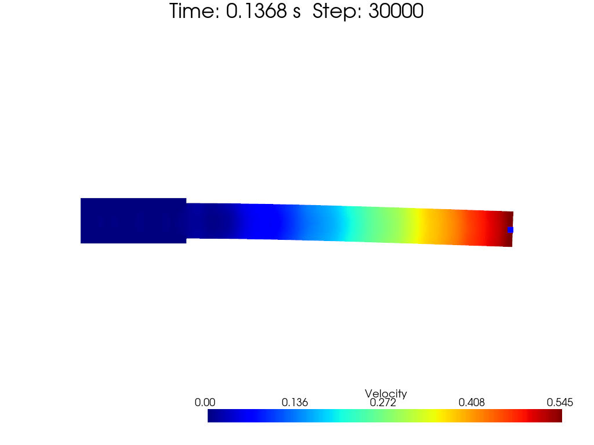

[toc]

# Hanging Beam

This example is originally from [Essentially non-hourglass and non-tensile-instability SPH elastic dynamics, Zhang, Chi 2024](https://www.sciencedirect.com/science/article/abs/pii/S0307904X22003742).

The problem discussed in this example is a hanging beam. The beam is made of a linear elastic material with Young's modulus $E$, poisson's ratio $\nu$ and density $\rho$. The beam is hanging from a fixed point and is applied with an initial velocity. The model setup picture is shown below.

 
figure: Model setup for hanging beam example (2D)

We first discuss the 2D case.

# 2D Case

Let's see the 2D case first. 

The color map of the beam is shown below.

 

 
figure: Color map of hanging beam example, velocity, jet (2D)

And the comparison of the beam shape at different time steps is shown below.

 
figure: Comparison of beam shape at different time steps (2D)

# Discussion

Actually, the author of the paper provides a confusing formula for the $\frac{\mathrm{d}\vec{v}_s}{\mathrm{d}t}$, as well as a magic number $\zeta$ related to smooth kernel and particle spacing. You may modify it to make your curve fits for the analytical solution.

$$
\begin{equation}
\frac{\mathrm{d}\vec{v}_s}{\mathrm{d}t} = 
2\zeta \frac{G}{\rho}\int_0^t\left(
    \sum_j \frac{m_j}{\rho_j}
    \frac{\vec{e}_{ij}\cdot\vec{v}_{ij}}{r_{ij}}
    \nabla W_{ij}
\right)\mathrm{d}t
\end{equation}
$$

In his paper, the author says that *$\zeta$ is a parameter related to the smoothing length $h$ and the type of kernel function. $\zeta$ needs to be calibrated with numerical experiments.* He choose Wendland 5-th kernel, $h=2.6\Delta p$, and he sets that:

$$
\begin{equation}
\zeta = 0.7d + 2.1
\end{equation}
$$

where $d$ is the dimension of the problem.