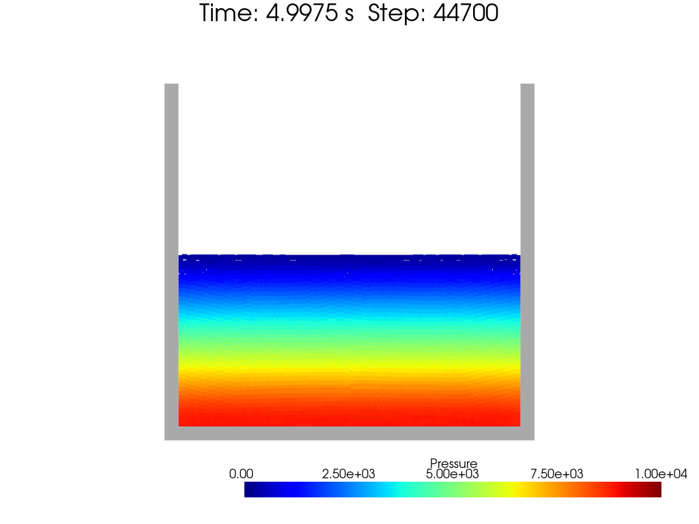

[toc]

# Hydrostatic Pressure Problem

When fluid motion is at rest, the momentum equation reduces to the hydrostatic pressure equation:

$$
\begin{equation}
    \frac{1}{\rho}\nabla p = \vec{g} \to\text{(in y direction)}
    \frac{1}{\rho}\frac{\mathrm{d}p}{\mathrm{d}y} = -g
\end{equation}
$$

Thus we have the pressure distribution along gravity direction:

$$
\begin{equation}
    p(y) = p_0 - \rho g y
\end{equation}
$$

where $p_0$ is the pressure at $y=0$.

# Water Column Pressure

Set the fluid density $\rho = 1000\, \text{kg/m}^3$ and the gravity $g = 10\, \text{m/s}^2$. Let's see the distribution of pressure in a water column with $1 \, \text{m}$ height.

 
fig. Pressure distribution in a water column (Hydrostatic Pressure)

Obviously, for the weakly compressible model, the pressure maximum is not that accurate at the bottom of the water column, although the pressure distribution is still linear along the gravity direction.