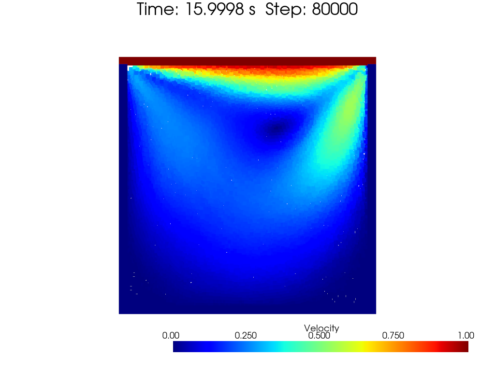
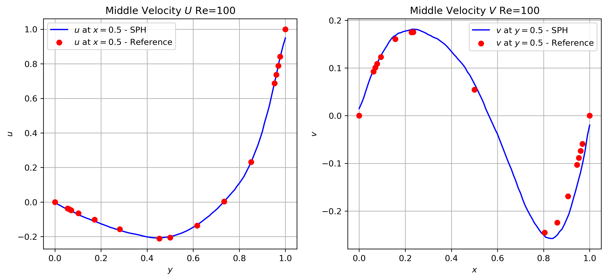
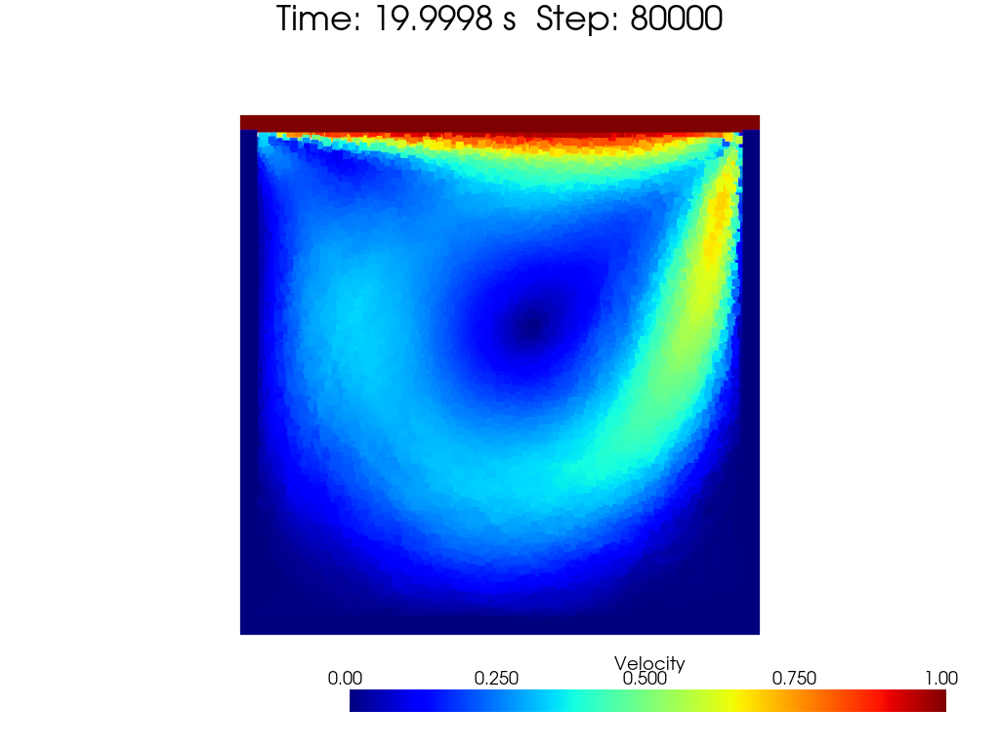
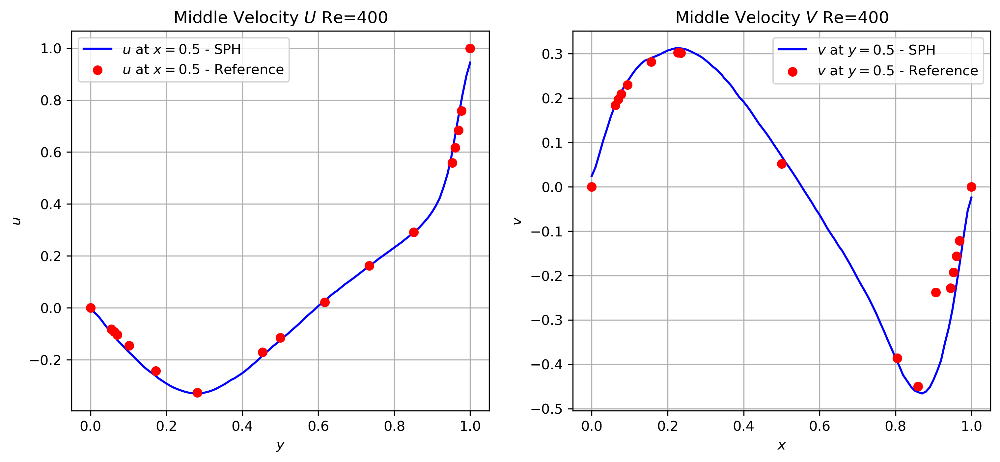

[toc]

# Lid-driven Cavity

Lid-driven cavity flow is a classic benchmark problem for incompressible flow solvers. The flow is driven by a constant velocity in the x-direction at the top boundary, while the other boundaries are no-slip walls. The Reynolds number is defined as:

$$
\begin{equation}
Re = \frac{\rho U L}{\mu}
\end{equation}
$$

$U$ is the lid x-direction velocity, $L$ is the length of the cavity, $\mu$ is the dynamic viscosity, and $\rho$ is the fluid density. Usually, we set the density to $1$ and the dynamic viscosity can be calculated as $\mu = \frac{\rho U L}{Re}$ as Reynolds number is given.

Reference and comparison can be found in [High-Re solutions for incompressible flow using the Navier-Stokes equations and a multigrid method, Ghia, 1982](https://www.sciencedirect.com/science/article/abs/pii/0021999182900584).

# Different Reynolds number

## Parameters you may modify

In my personel experience, the following parameters are important for the lid-driven cavity flow:

1. The kernel function you choose, like `CubicSpline`, `WendlandC2`, `WendlandC4`, etc. `CubicSpline` suffers numerical instability more easily than `WendlandC2` and `WendlandC4`.
2. Sound speed $c$. The sound speed is used to calculate the pressure force. A larger sound speed may lead to a more stable simulation. A good choice is $c\in [10, 20]$. However, a larger sound speed may lead to longer simulation time.
3. The background pressure $p_0$. The background pressure is used to calculate the pressure force. Small $p_0$ will lead to tensile instability, causing blank space in the cavity. Large $p_0$ will lead to unordered particle distribution. It's better to choose $p_0\in [0.001c^2\rho_0, 0.05c^2\rho_0]$. $1\%\%\to5\%$ variation of density is acceptable in weakly compressible flow.
4. The kernel average density filter interval. The kernel average density filter is used to calculate the density. A smaler interval will lead to a more stable simulation, though it's more expensive in computation. A good choice is $10\sim 20$.
5. Total simulation time. Usually, high Reynolds number needs longer simulation time to reach a stable status. A good choice is $t\in [15, 50]$$.
6. The most important thing is the boundary you choose. The boundary should be able to perform both pressure and viscosity force. The boundary should be able to prevent the fluid from moving out of the cavity. The boundary should be able to perform the compulsive force if needed.

## Reynolds number: 100

We choose `CubicSpline`, $c=15.0$, $p_0=0.002c^2\rho_0$, and a kernel average density filter interval as $10$. The stable flow status is reached at $t=15.0$. The wall performs both $p_0$ pressure and viscosity force. Also, a compulsive force is applied to prevent the fluid from moving out of the cavity.

The stable particle distribution is shown below, colored by velocity magnitude:

 
fig: lid-driven cavity flow at reynolds number 100

Also, a comparison with the Ghia's results is shown below:

 
fig: lid-driven cavity flow reference comparison at reynolds number 100

## Reynolds number: 400

We choose `WendlandC2`, $c=12.0$, $p_0=0.003c^2\rho_0$, and a kernel average density filter interval as $10$. The stable flow status is reached at $t=20.0$. The wall performs both $p_0$ pressure and viscosity force. Also, a compulsive force is applied to prevent the fluid from moving out of the cavity.

The stable particle distribution is shown below, colored by velocity magnitude:

 
fig: lid-driven cavity flow at reynolds number 400

Also, a comparison with the Ghia's results is shown below:

 
fig: lid-driven cavity flow reference comparison at reynolds number 400

