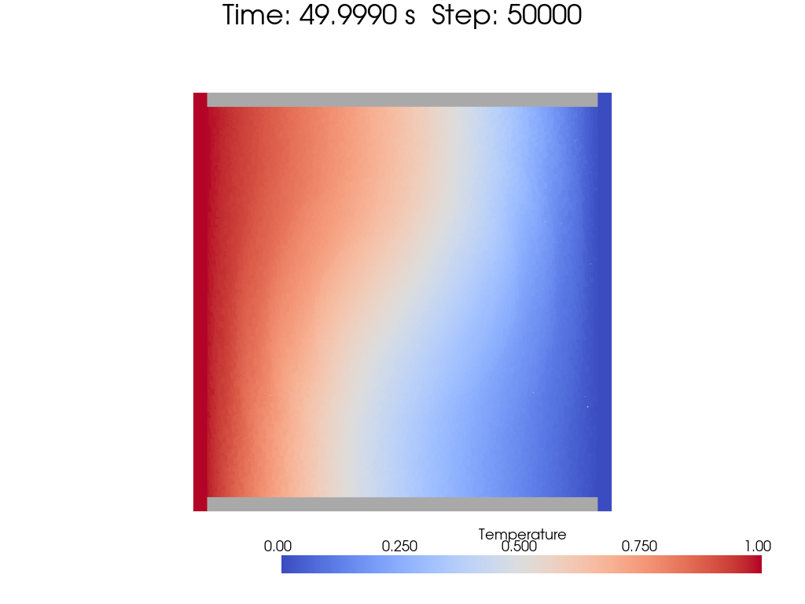
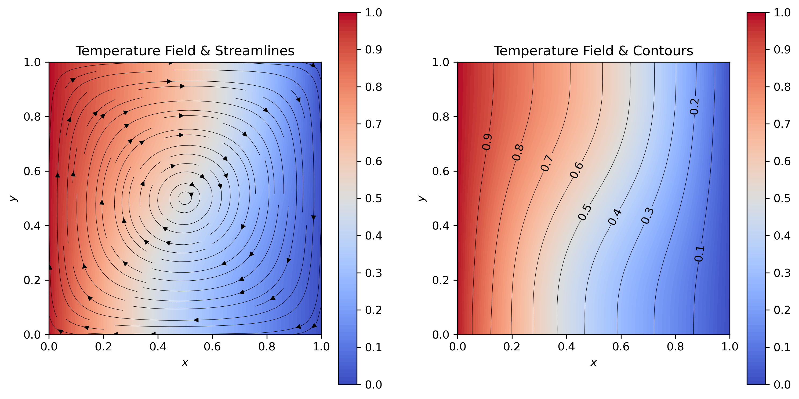
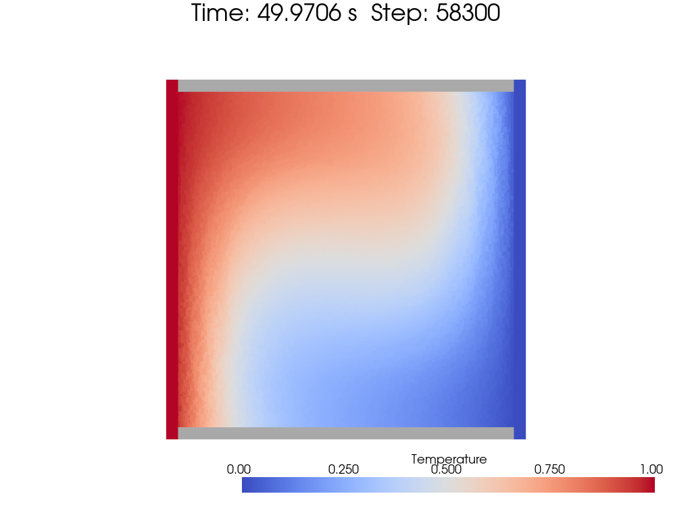
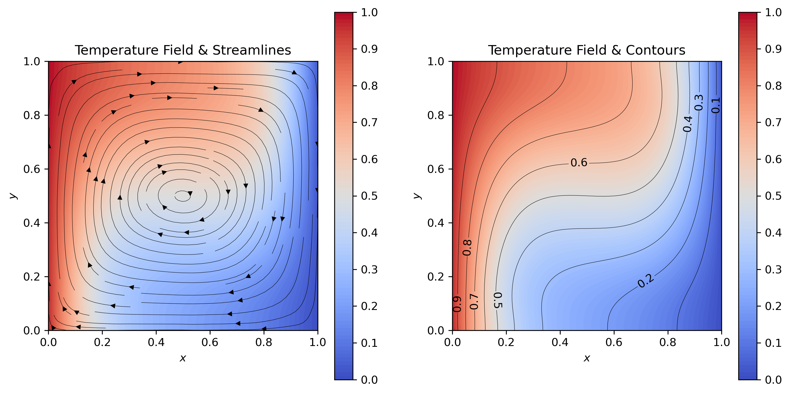

[toc]

# Natural Convection Cavity

Natural convection cavity flow is a classic benchmark problem for incompressible flow solvers. The flow is driven by the temperature difference between the left and right boundaries, where the left boundary is heated and the right boundary is cooled at a constant temperature. Top and bottom boundaries are set as adiabatic walls. The Rayleigh number is defined as:

$$
\begin{equation}
Ra = \frac{g\beta\Delta T L^3}{\nu\alpha}
\end{equation}
$$

And Prandtl number defined as:

$$
\begin{equation}
Pr = \frac{\nu}{\alpha} = \frac{c_p\mu}{ \kappa}
\end{equation}
$$

The governing equations under Boussinesq approximation will turn into:

$$
\begin{equation}
    \begin{aligned}
        \frac{\mathrm{d}\rho}{\mathrm{d} t} &= -\rho \nabla \cdot \vec{v} \\
        \frac{\mathrm{d}\vec{v}}{\mathrm{d} t} &= -\frac{1}{\rho} \nabla p + \nu \nabla^2 \vec{v} - \vec{g} \beta (T - T_0)\\
        \rho c_p\frac{\mathrm{d}T}{\mathrm{d} t} &= \nabla \cdot (\kappa\nabla T)
    \end{aligned}
\end{equation}
$$

The first paper discussing SPH in heat transfer is by [Conduction Modelling Using Smoothed Particle Hydrodynamics, Monaghan 1999](https://www.sciencedirect.com/science/article/abs/pii/S0021999198961186?via%3Dihub).

And the parameters settings and results are from [ChangQing Tong](http://www.ir.xjtu.edu.cn/item/244952). Pardon me, i'm the native Chinese speaker, for the lack of English references.

Dimensionless form of euqation is from [FengXu](https://qikan.cqvip.com/Qikan/Article/Detail?id=76887490504849524848484851), shown as below:

$$
\begin{equation}
    \begin{aligned}
        \frac{\mathrm{d} \rho}{\mathrm{d} t} &= -\nabla \cdot \vec{v} \\
        \frac{\mathrm{d} \vec{v}}{\mathrm{d} t} &= -\nabla p + \frac{Pr}{\sqrt{Ra}} \nabla^2 \vec{v} + Pr (T - T_0)\vec{j}\\
        \frac{\mathrm{d} T}{\mathrm{d} t} &= \frac{1}{\sqrt{Ra}}\nabla^2 T
    \end{aligned}
\end{equation}
$$

# TODO

**TODO**: Post process to interpolate SPH results to a grid. Possible reference is [SPHtoGrid.jl](https://github.com/LudwigBoess/SPHtoGrid.jl). Although `pyvista` has built-in interpolate utils, it's better to do the interpolation under SPH's kernel method.

# Tricks you may modify

1. The weakly compressible SPH method is used here. Thus whether to use $p = c^2(\rho - \rho_0)+p_0$ or $p = \frac{c^2\rho_0}{\gamma}\left[\left(\frac{\rho}{\rho_0}\right)^\gamma-1\right]+p_0$ can be modified. In my personal experience, the previous one reaches high nusselt number and the latter one reaches low nusselt number.
2. Sound speed $c$ and background pressure $p_0$ is important.
3. Coefficient to avoid siguarity like: $r^2+0.01h^2$. In strict sense, the $0.01h^2$ part should be ignored.

# Different Rayleigh Numbers

## Rayleigh Number = 1e3

The temperature distribution colored by temperature is shown below:

 
fig: temperature distribution at Rayleigh number = 1e3

And the streamlines with temperature contour lines are shown below:

 
fig: temperature distribution at Rayleigh number = 1e3

## Rayleigh Number = 1e4

The temperature distribution colored by temperature is shown below:

 
fig: temperature distribution at Rayleigh number = 1e4

And the streamlines with temperature contour lines are shown below:

 
fig: temperature distribution at Rayleigh number = 1e4

# My previous work: error of Nusselt number

| $Ra$ | Ref 1 | Ref 2 | Ref 3 | SPH | Error % | N | N Sample | $P_g\quad \times c_0^2 \rho_0$ |
| - | - | - | - | - | - | - | - | - |
| $10^3$ | 1.117 | 1.118 | 1.114 | 1.11718 | 0.016 | 100 | 88 | 0.1 |
| $10^4$ | 2.235 | 2.243 | 2.245 | 2.35214 | 0.09 | 100 | 101 | 0.02 |
| $10^5$ | 4.504 | 4.519 | 4.510 | 4.5075 | 0.0777 | 100 | 111 | 0.02 |
| $10^6$ | 8.767 | 8.800 | 8.806 | 8.2798 | 5.5572 | 100 | 201 | 0.02 |