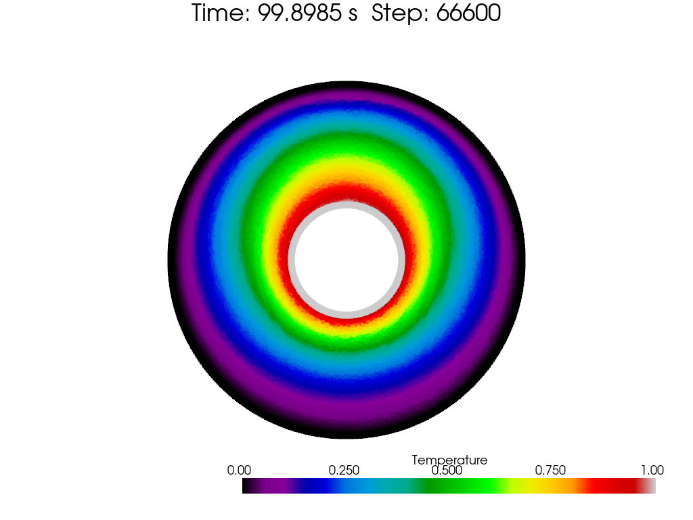

[toc]

# Natural Convection Ring

This example demonstrates the natural convection in a ring-shaped cavity filled with fluid. The ring is heated from a inner ring and cooled from an outer ring. The temperature difference between the inner and outer ring causes the fluid to circulate in the cavity.

Reference can be found here: [Wei Zhang, and Xiufeng Yang 2022](https://link.springer.com/article/10.1007/s10409-022-22093-x).

 
fig. Geometry of the natural convection ring problem.

> Eight thousand years old, heaven and earth are opened up, with clear yang as the sky and turbid yin as the earth. -- Calender of Three Emperors and Five Sovereigns

# Benchmark: contour & comparison

The benchmark results are obtained from the reference paper. With $r_o / r_i = 2.6$ and $Ra = 4.7 \times 10^4$, the benchmark results are shown in the following figure:

 
fig. Temperature field of the natural convection ring problem -- benchmark

A colormap from 'nipy_spectral' is used for different color layers. Also a temperature distribution along radius at different angles is shown in the following figure:

 
fig. Temperature distribution along radius at different angles -- benchmark

# Radius ratio: 1.5

 

 
fig. Temperature field of the natural convection ring problem -- radius ratio 1.5, rayleigh number 1e3, 1e4, 1e5, 1e6

# Radius ratio: 3.0

 

 
fig. Temperature field of the natural convection ring problem -- radius ratio 3.0, rayleigh number 1e3, 1e4, 1e5, 1e6

# Notes

- Higher Rayleigh number or smaller radius ratio will lead to more complex flow patterns, which is harmful for the convergence of the numerical solution.
- Comparison of curves along radius at different angles is not included for more cases, it's really a time-consuming task to 'steal' the data from the reference paper and generate the figure for my codes' results.
- Initial temperature distribution is also important (reference $T_0$).