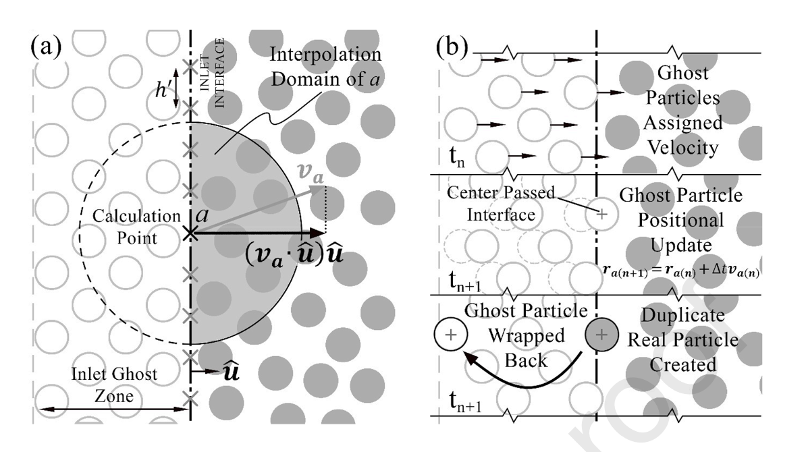

[toc]

# Poiseuille Flow

Poiseuille flow is a type of flow in a pipe where the flow is driven by a pressure gradient. The flow is laminar and the velocity profile is parabolic.

The governing equation for Poiseuille flow is the incomressible Navier-Stokes equation.

Usually, the pressure gradient can be performed by a body force along the pipe. Assuming the flow is the same along $x$ direction ($\partial/\partial x = 0$), the steady-state ($\partial/\partial t = 0$), and vertical velocity $v$ is zero ($v = 0$), the governing equation can be simplified to:

$$
\begin{equation}
    \mu \frac{\mathrm{d}^2u}{\mathrm{d}y^2}=\frac{\mathrm{d}p}{\mathrm{d}x}
\end{equation}
$$

Denote $f_x = -\frac{\mathrm{d}p}{\mathrm{d}x}$, the solution of the equation is:

$$
\begin{equation}
    u = -\frac{f_x}{2\mu}y^2 + C_1y + C_2
\end{equation}
$$

where $C_1$ and $C_2$ are constants. Apply the boundary condition $u(0) = 0$ and $u(h) = 0$, the solution is:

$$
\begin{equation}
    u = \frac{f_x}{2\mu}y(h-y)
\end{equation}
$$

The $\max(u)$ is at $y = h/2$, with value:

$$
\begin{equation}
    u_{\max} = \frac{f_x}{8\mu}h^2
\end{equation}
$$

And the mean velocity is:

$$
\begin{equation}
    u_{\text{mean}} = \frac{1}{h}
    \int_0^h u \mathrm{d}y = \frac{f_x}{12\mu}h^2
\end{equation}
$$

Also, when devided by density, the equation can be written as:

$$
\begin{equation}
    u(y) = \frac{a_x}{2\nu}y(h-y)
\end{equation}
$$

where $\nu = \mu/\rho$ is the kinematic viscosity, and $a_x = f_x/\rho$ is the acceleration.

When the flow is driven by a body force, starting from steady-state, a time-related series analytical solution can be obtained:

$$
\begin{equation}
    \begin{aligned}
        u(y, t) = &\frac{a_x}{2\nu}y(h-y) - \\
    &\sum_{n=0}^{\infty} \frac{4a_x h^2}{\nu \pi^3 (2n+1)^3}
    \sin\left[
        (2n + 1)\frac{\pi y}{h}
    \right]
    \exp\left[
        -\frac{\nu \pi^2 (2n+1)^2 t}{h^2}
    \right]
    \end{aligned}
\end{equation}
$$

# Treat boundary particles as the same

## Re = 100, periodic boundary condition

The main idea of periodic boundary condition is to let the outlet particles go back to the inlet.

In my code, the periodic boundary condition is implemented by the following steps:

1. let the boundary cell (which is used to do fast-neighbour search) contain the neighbour `CartesianIndex`. For example, let `CartesianIndex(1, 1)`'s cell contains `CartesianIndex(nx, 1)` and `CartesianIndex(nx, 2)`.
2. add a `displacement::RealVector{Dimension}` to represent a relative position correction between periodic boundary cells. For example, the displacement of `CartesianIndex(1, 1)` is `displacement = Vector2D(pipe_length, 0)`. Thus, when `p` in `CartesianIndex(1, 1)` cell will be added with `displacement` to find the neighbour particle `q` in `CartesianIndex(nx, 1)` cell.
3. As long as the above steps are done, the periodic boundary condition is implemented. Particles near outlet will interact with particles near inlet. But you still need to move particles out of outlet into inlet or inlet into outlet, for example, in `accelerationAndMove!` function defined by yourself.

<center>

</br>
fig. Poiseuille flow with Re=100, same boundary particles, periodic boundary condition
</center>

And the comparison of the velocity profile at $x = 0.5L$:

<center>

</br>
fig. Poiseuille flow with Re=100, same boundary particles, periodic boundary condition
</center>

## Re = 100, buffer-zone boundary condition

The buffer-zone boundary condition is more complicated than the periodic boundary condition. The main idea is to create a inlet buffer zone to emit particles and an outlet buffer zone to provide pressure force avoiding wrong outlet pressure condition.

[David W Holmes 2020](https://www.sciencedirect.com/science/article/abs/pii/S0021999120308032) and [Tim Verbrugghe Tim Verbrugghe 2019](https://www.mdpi.com/1996-1073/12/4/697) 's paper would be helpful to understand the buffer-zone boundary condition. I just simply post their important figures below:

<center>

</br>
fig. Buffer zone boundary condition, David W Holmes 2020, Novel pressure inlet and outlet boundary conditions for Smoothed Particle Hydrodynamics, applied to real problems in porous media flow
</center>

<center>

</br>
fig. Buffer zone boundary condition, Tim Verbrugghe Tim Verbrugghe 2019, Implementation of Open Boundaries within a Two-Way Coupled SPH Model to Simulate Nonlinear Wave–Structure Interactions
</center>

In my code, the buffer-zone boundary condition is implemented with the aid of `ThreadSafeParticleCollector` which collects particles in a multi-threads environment. You may see the core part below:

```julia
@inline function handleInletAndOutlet!(system::ParticleSystem, thread_safe_particle_collector::ThreadSafeParticleCollector; t::Float64 = 0.0)::Nothing
    Threads.@threads for i in eachindex(system)
        p = system[i]
        if p.type_ == INLET_TAG && p.x_vec_[1] >= x0
            p_copy = deepcopy(p)
            p.x_vec_[1] -= buffer_length
            setTheoreticalVelocity!(p; t = t)
            p.rho_ = rho_0
            p.p_ = p_0
            p_copy.type_ = FLUID_TAG
            push!(thread_safe_particle_collector, p_copy)
        elseif p.type_ == FLUID_TAG && p.x_vec_[1] >= x0 + pipe_length
            p.type_ = OUTLET_TAG
            setTheoreticalVelocity!(p; t = t)
            p.rho_ = rho_0
            p.p_ = p_0
        else
            continue
        end
    end
    append!(system, thread_safe_particle_collector)
    return nothing
end
```

And results are shown below:

<center>

</br>
fig. Poiseuille flow with Re=100, same boundary particles, buffer-zone boundary condition
</center>

And the comparison of the velocity profile at $x = 0.5L$:

<center>

</br>
fig. Poiseuille flow with Re=100, same boundary particles, buffer-zone boundary condition
</center>

## 3D Re=100 periodoc

<center>

</br>
fig. Poiseuille flow with Re=100, same boundary particles, buffer-zone boundary condition
</center>

The stable governing equation here should be:

$$
\begin{equation}
\begin{aligned}
    -a_z=\frac{\mathrm{d}p}{\mathrm{d}z}=\mu \frac{1}{r}\frac{\mathrm{d}}{\mathrm{d}r}\left(
        r\frac{\mathrm{d}w}{\mathrm{d}r}
    \right)
\end{aligned}
\end{equation}
$$

The solution will be:

$$
\begin{equation}
\begin{aligned}
    w(r) = \frac{a_z}{4\mu}(R^2 - r^2)
\end{aligned}
\end{equation}
$$

with:

$$
\begin{equation}
\begin{aligned}
    w_{\max} = \frac{a_z}{4\mu}R^2\quad w_{\text{mean}} = \frac{1}{2}w_{\max}
\end{aligned}
\end{equation}
$$

# Notes

1. The buffer-zone boundary condition is more complicated than the periodic boundary condition. Buffer-zone boundary will force the user be more careful when handling the boundary condition. It's not easy to use.
2. Although buffer-zone seems to be more accurate, there's still abnormal pressure disturbance at the inlet and outlet. **Apply periodic as long as you can.**
3. The reason why I didn't use *compulsive force* from wall here is that as reynolds number becomes larger, compulsive force from walls will casues noises near the wall. Thus, I just treat the boundary particles as the same as the fluid particles which provides pressure force as fluid particles come close to them.