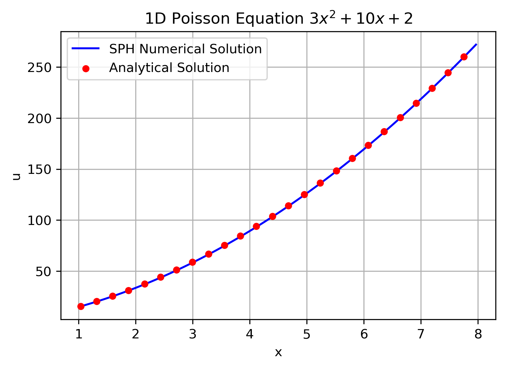
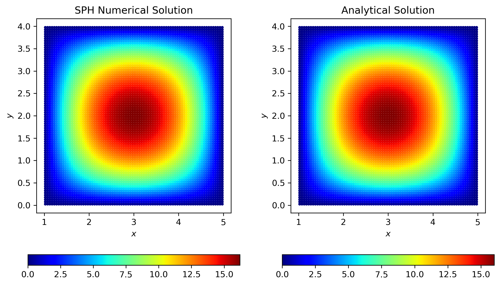

[toc]

# Poisson Equation

Poisson equation is a partial differential equation that describes the distribution of a potential field. The general form of the Poisson equation is:

$$
\begin{equation}
    \nabla^2 u + f = 0
\end{equation}
$$

In SPH method, the Poisson equation can be discretized in particle form:

$$
\begin{equation}
    \sum_j\frac{2m_j}{\rho_j}\frac{W^\prime_{ij}}{r_{ij}}(u_i-u_j) 
    = -\sum_j \frac{m_j}{\rho_j} f_j W_{ij}
\end{equation}
$$

Usually, poisson equation is solved by finite element method (FEM). A test function related to mesh elements is used to approximate the solution. Here, we use SPH method to show that the $\delta$-like kernel weight function $W(r)$ can perform as a test function in solving the poisson equation.

# 1D problem

Take a function as example:

$$
\begin{equation}
    u(x) = 3 x^2 + 10 x + 2
\end{equation}
$$

Which satisfies the Poisson equation:

$$
\begin{equation}
    \frac{\mathrm{d}^2 u}{\mathrm{d}x^2} - 6 = 0
\end{equation}
$$

Use SPH method to discretize the equation:

$$
\begin{equation}
    \sum_j\frac{2}{\Delta x}\frac{W^\prime(r_{ij})}{r_{ij}}(u_i-u_j) 
    = \sum_j \frac{6}{\Delta x} W(r_{ij})
\end{equation}
$$

Choose `WendlandC4` kernel function, and the smoothing length is $h=3\Delta x$, we will have:

 
fig. 1D poisson equation demo

This case indicates that the SPH method can solve the Poisson equation in 1D space. In addition, a regular distribution of particles leads to a better result, as shown in the figure above.

# 2D problem

Take a function as example:

$$
\begin{equation}
    u(x, y) = (x-1)(x-5)y(y-4)
\end{equation}
$$

Which satisfies the Poisson equation:

$$
\begin{equation}
    \nabla^2 u - 2(x-1)(x-5) - 2y(y-4) = 0
\end{equation}
$$

where $f$ is the source term:

$$
\begin{equation}
    f(x,y) = -2(x-1)(x-5) - 2y(y-4)
\end{equation}
$$

Use SPH method to discretize the equation:

$$
\begin{equation}
    \sum_j\frac{2m_j}{\rho_j}\frac{W^\prime(r_{ij})}{r_{ij}}(u_i-u_j) 
    = -\sum_j \frac{m_j}{\rho_j} f(x_j, y_j) W(r_{ij})
\end{equation}
$$

Again, we use `WendlandC4` kernel function, and the smoothing length is $h=3\Delta x$, we will have:

 
fig. 2D poisson equation demo

