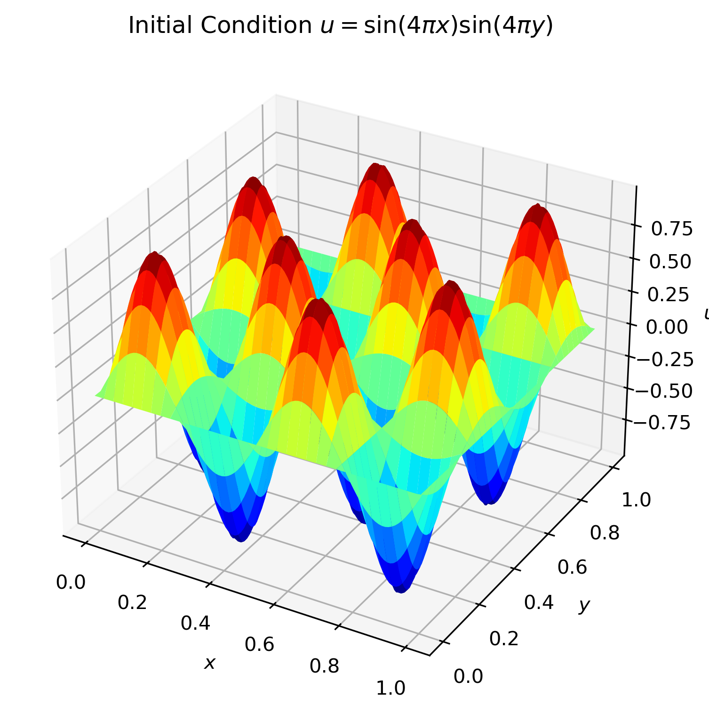
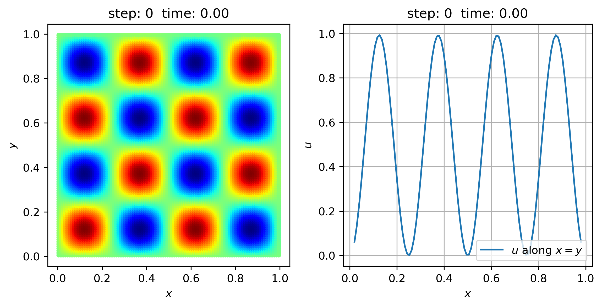
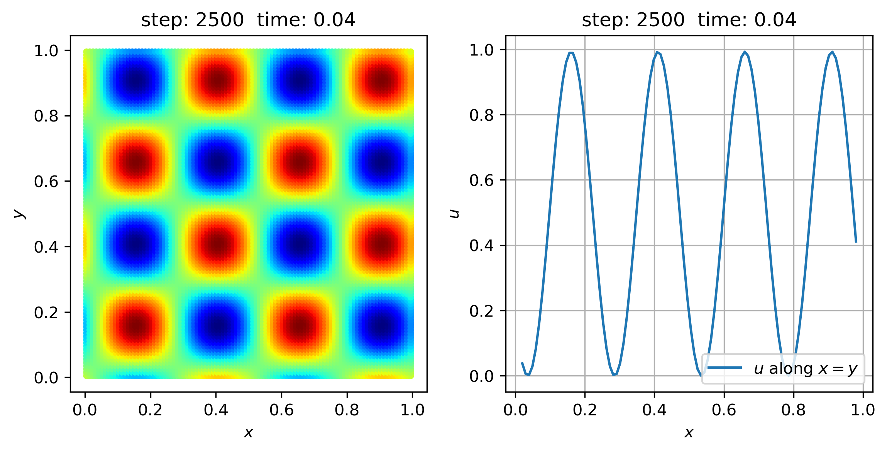
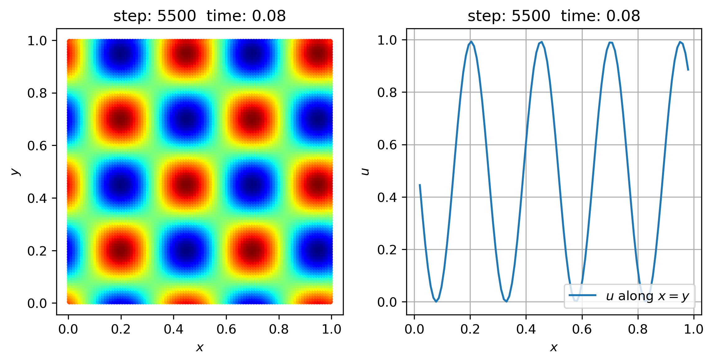
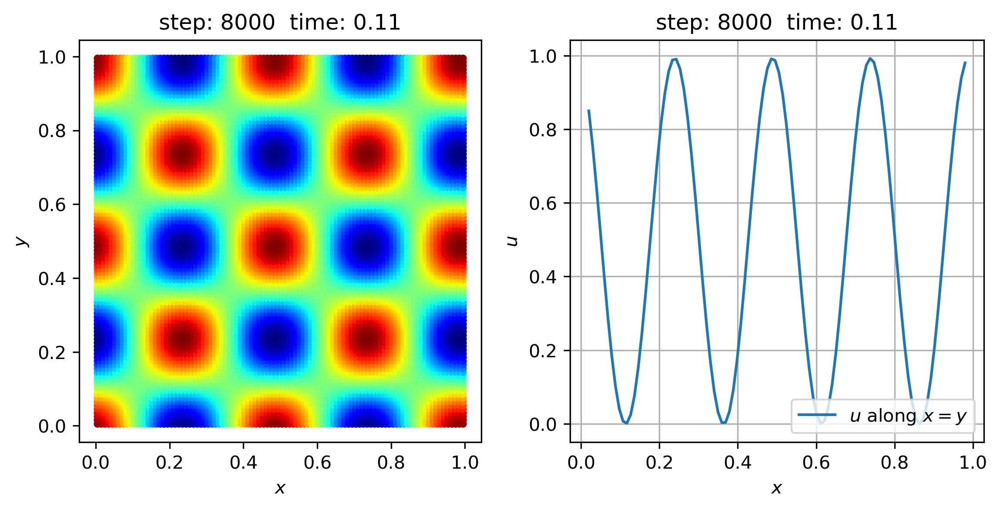
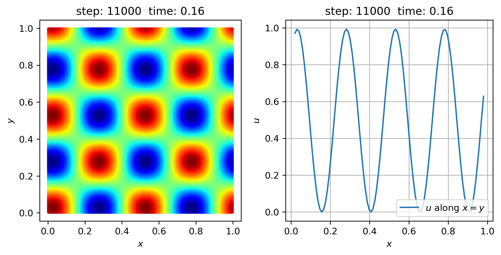
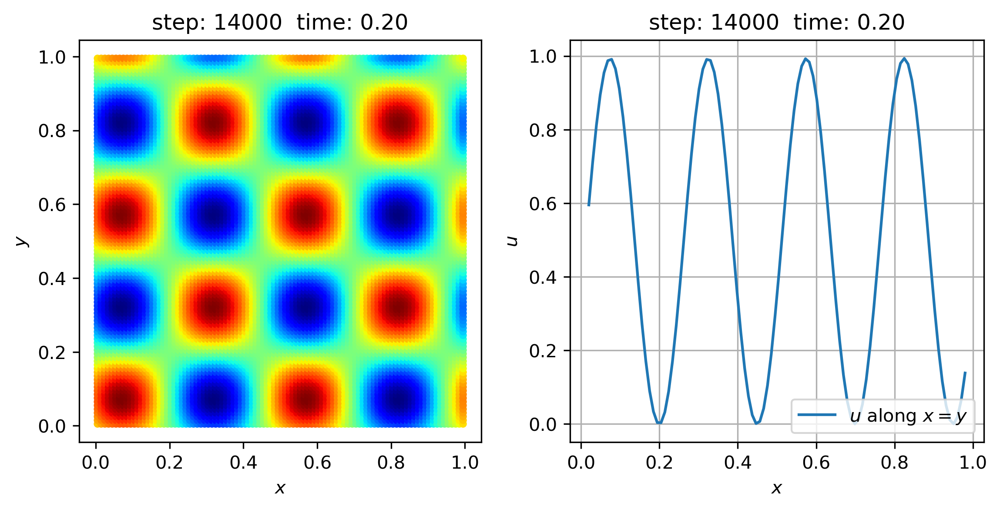
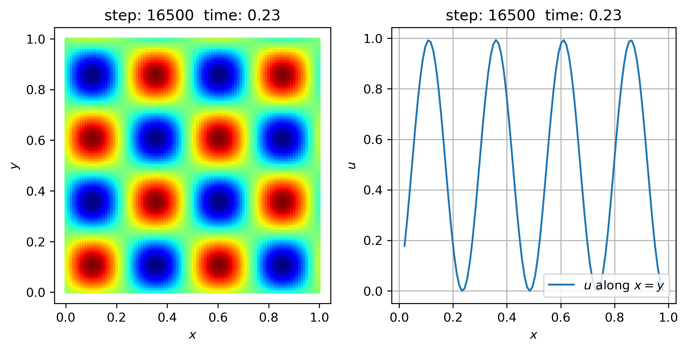

[toc]

# Single Wave Equation

Single wave equation is a partial differential equation that describes the propagation of a wave in a medium. In 1D case, the wave equation is given by:

$$
\begin{equation}
    \frac{\partial u}{\partial t}+
    c\frac{\partial u}{\partial x}=0
\end{equation}
$$

In 2D case, the wave equation is given by:

$$
\begin{equation}
    \frac{\partial u}{\partial t}+
    \nabla\cdot \vec{f}(u)=0
\end{equation}
$$

For example, $\vec{f}(u)=\alpha u\vec{i} + \beta u\vec{j}$, such equation can be rewritten as:

$$
\begin{equation}
    \frac{\partial u}{\partial t}+
    \alpha\frac{\partial u}{\partial x}+
    \beta\frac{\partial u}{\partial y}=0
\end{equation}
$$

or:

$$
\begin{equation}
    \frac{\partial u}{\partial t}+
    \vec{c}\cdot\nabla u=0
\end{equation}
$$

In SPH discretization, the wave equation can be discretized as:

$$
\begin{equation}
    \frac{\partial}{\partial t}\int_{\Omega}W(\vec{r}^\prime-\vec{r})u(\vec{r}^\prime) \mathrm{d} \vec{r}^\prime+
    \int_\Omega \vec{c} \cdot \nabla u(\vec{r})W(\vec{r}^\prime-\vec{r}) \mathrm{d} \vec{r}^\prime=0
\end{equation}
$$

The time derivative part can be discretized as:

$$
\begin{equation}
    \frac{\partial}{\partial t}\int_{\Omega}W(\vec{r}^\prime-\vec{r})u(\vec{r}^\prime) \mathrm{d} \vec{r}^\prime \approx
    \sum_j \frac{m_j}{\rho_j}W_{ij}\frac{\partial u_j}{\partial t}
    \approx \frac{\partial u_i}{\partial t}
\end{equation}
$$

The spatial derivative part can be discretized as (considering $\nabla\cdot\vec{c}=0$):

$$
\begin{equation}
    \begin{aligned}
        \int_\Omega \vec{c} \cdot \nabla u(\vec{r})W(\vec{r}^\prime-\vec{r}) \mathrm{d} \vec{r}^\prime
        &=
        \int_\Omega (W\vec{c}) \cdot \nabla u\mathrm{d} \Omega\\
        &=\int_{\partial\Omega} uW\vec{c}\cdot \vec{n} \mathrm{d}\Gamma-
        \int_\Omega u\nabla\cdot(W\vec{c})\mathrm{d}\Omega\\
        &=-\int_\Omega u\nabla W\cdot \vec{c}\mathrm{d}\Omega - \int_\Omega uW\nabla\cdot\vec{c}\mathrm{d} \Omega\\
        &\approx \sum_j \frac{m_j}{\rho_j}u_j \nabla W_{ij}\cdot \vec{c}
    \end{aligned}
\end{equation}
$$

for:

$$
\begin{equation}
    \sum_j \frac{m_j}{\rho_j}u_i \nabla W_{ij}=\vec{0}
\end{equation}
$$

thus:

$$
\begin{equation}
    \int_\Omega \vec{c} \cdot \nabla u(\vec{r})W(\vec{r}^\prime-\vec{r}) \mathrm{d} \vec{r}^\prime
    \approx -\sum_j \frac{m_j}{\rho_j}u_{ij} \nabla W_{ij}\cdot \vec{c}
\end{equation}
$$

An inaccurate but simple SPH discretization of wave equation can be obtained as:

$$
\begin{equation}
    \frac{\partial u_i}{\partial t}=\sum_j \frac{m_j}{\rho_j}u_{ij} \nabla W_{ij}\cdot \vec{c}
\end{equation}
$$

where $u_{ij}=u_i-u_j$.

# Single Wave 2D Demo

Let's see a simple demo of single wave equation. The initial condition is given by:

$$
\begin{equation}
    u(x,y)=\sin(4\pi x) \sin (4\pi y)
\end{equation}
$$

A 3D plot of the initial condition is shown below:

 
fig. Initial condition of single wave equation

A periodic boundary condition is applied for such particle system in both $x$ and $y$ direction. With time evolution, the wave propagates in the medium. I simply set the characteristic speed $c=1\vec{i}+1\vec{j}$, the time evolution of the wave is shown below:

 

 

 

 

 

 

 
fig. Time evolution of single wave equation

A sets of view point along line $y=x$ is also included.

> note: it seems $\Delta t$ should be set as small enough to ensure numerical stability. -- 2024.07.23